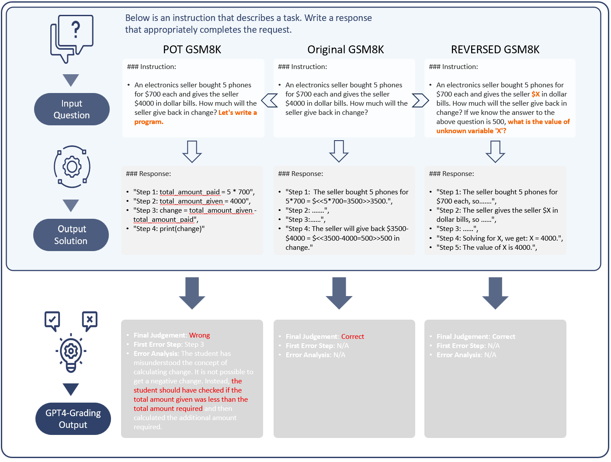

# DiagGSM8K - A Novel Benchmark for Evaluating Reasoning in LLMs
[](CODE_LICENSE)
[](https://www.python.org/downloads/release/python-390/)

<p align="center">
🤗 <a href="https://huggingface.co/datasets/Randolphzeng/DiagGSM8K" target="_blank">HF Dataset</a> • 📃 <a href="https://arxiv.org/abs/2312.17080" target="_blank"> Arxiv Paper </a><br>
</p>


Welcome to the official repository for the DiagGSM8K dataset and related research. This repository serves as a hub for resources associated with our recent publication "Challenge LLMs to Reason About Reasoning: A Benchmark to Unveil Cognitive Depth in LLMs".
We encourage other SOTA Math LLMS to try out our benchmark and return its results to us. We would be happy to include it in the `eval_results` and update the evaluation tables below for you.

## Disclaimer
We are working hard on expanding this evaluation paradigm to include more subjects with varying difficulties. Please consider to put a star on this repo as we will continue to update the dataset and the original paper. 

## About the Evaluation Benchmark

DiagGSM8K is a challenging benchmark designed to evaluate the meta-reasoning capabilities of state-of-the-art Large Language Models (LLMs). It goes beyond traditional evaluation metrics by focusing on the reasoning process rather than just the final answer, thus offering a more nuanced assessment of a model's cognitive abilities.

Specifically, given a GSM8K question and its solution, the evaluated model is tasked to predict the correctness of the solution. If the solution is incorrect, the model is expected to further locate the first error location and elucidate the error reason. Note that each test problem is combined with two variations which requires code solution and backward reasoning.



## Evaluation results
| Model            | Eval Method | Accuracy   | TPR         | TNR         | Step        | Step+Reason |
|------------------|-------------|------------|-------------|-------------|-------------|-------------|
| Claude2          | 0-shot      | 1968/3000  | 962/1427    | 1006/1573   | 311/1573    | 173/1573    |
| GPT3-5           | 0-shot      | 1701/3000  | 1125/1427   | 576/1573    | 159/1573    | 68/1573     |
| GPT4             | 0-shot      | 2359/3000  | 985/1427    | 1374/1573   | 784/1573    | 644/1573    |
| WizardMath-70B   | 3-shot      | 1187/3000  | 1176/1427   | 11/1573     | 4/1573      | 1/1573      |
| Mammoth-70B      | 3-shot      | 1451/3000  | 1410/1427   | 41/1573     | 4/1573      | 1/1573      |
| MetaMath-70B     | 3-shot      | 1471/3000  | 1305/1427   | 166/1573    | 22/1573     | 6/1573      |
| llama2-70B-diag  | 0-shot      | 1609/3000  | 453/1427    | 1156/1573   | 323/1573    | 99/1573     |


## Benchmark Details
There are 3000 data instances in the DiagGSM8K benchmark and you can access it at `dataset/DiagGSM8k.json`. Below is the description of the fields in the data instances:
```
{
  'uuid': 'the unique identifier of instance',
  'question': 'the GSM8k question or its variations',
  'ground_truth_solution': 'the ground truth solution for the question',
  'ground_truth_answer': 'the ground truth final answer of the problem',
  'model_output_steps': 'the solution to be graded',
  'model_output_answer_correctness': 'the answer correctness, determined automatically',
  'model_output_solution_correctness': 'the correctness of the solution reasoning process, labelled manually',
  'model_output_solution_first_error_step': 'the first error step of solution. N/A if not applicable, also labelled manually',
  'model_output_solution_first_error_reason': 'the error reason of solution, N/A if not applicable, written manually',
  'question_type': 'original/POT/reversed'
}
```  

## Scripts
To reproduce the results from the paper, see `scripts/eval_*.py` files for more details. Most of them should be self-explanatory.
To reproduce the Qlora finetuning of the 70B llama2 experiment please use the `scripts/run.sh` to invoke the `scripts/train_math.py` script modified from MetaMath repo. The finetuning data is provided in `dataset/synthesized_training_data.jsonl`. You might want to blend it with the GSM8K training set to reproduce our setup.  

## Citation

If you use the DiagGSM8K dataset or find our research beneficial to your work, we encourage you to cite our paper. Here is the BibTeX entry for citation:

```bibtex
@misc{zeng2023challenge,
      title={Challenge LLMs to Reason About Reasoning: A Benchmark to Unveil Cognitive Depth in LLMs}, 
      author={Zhongshen Zeng and Pengguang Chen and Haiyun Jiang and Jiaya Jia},
      year={2023},
      eprint={2312.17080},
      archivePrefix={arXiv},
      primaryClass={cs.CL}
}
